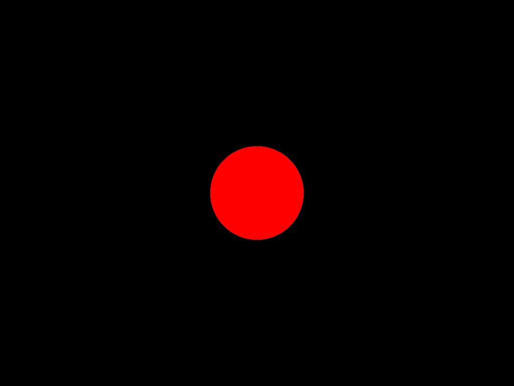
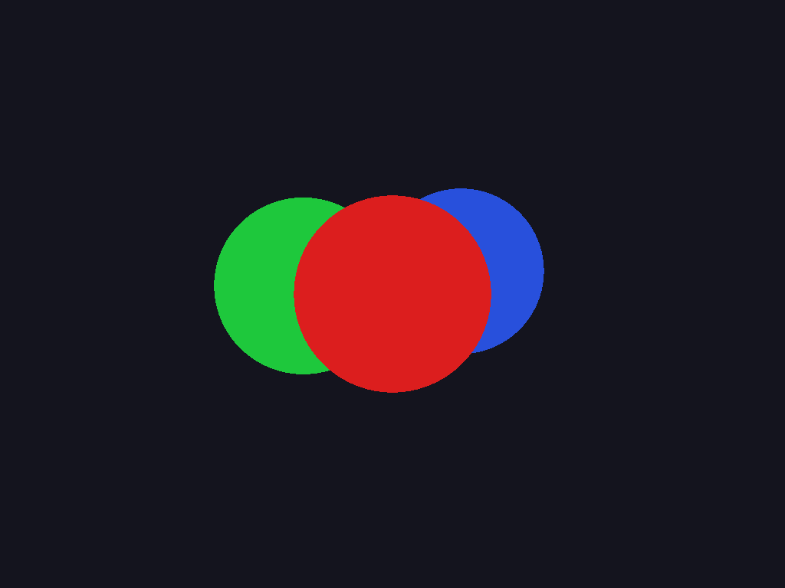
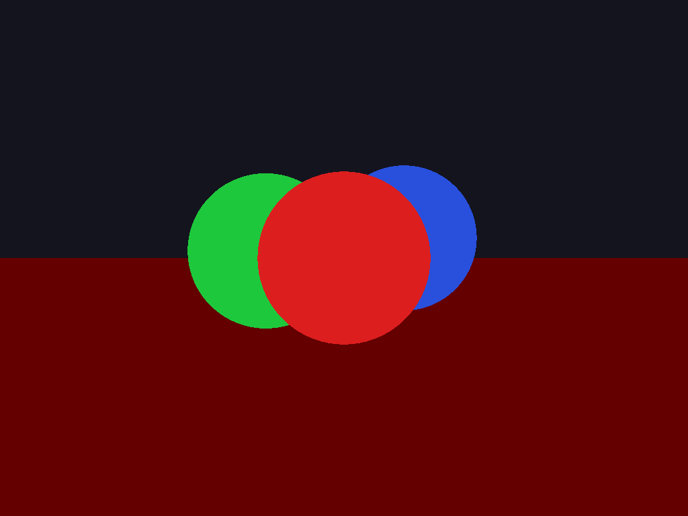
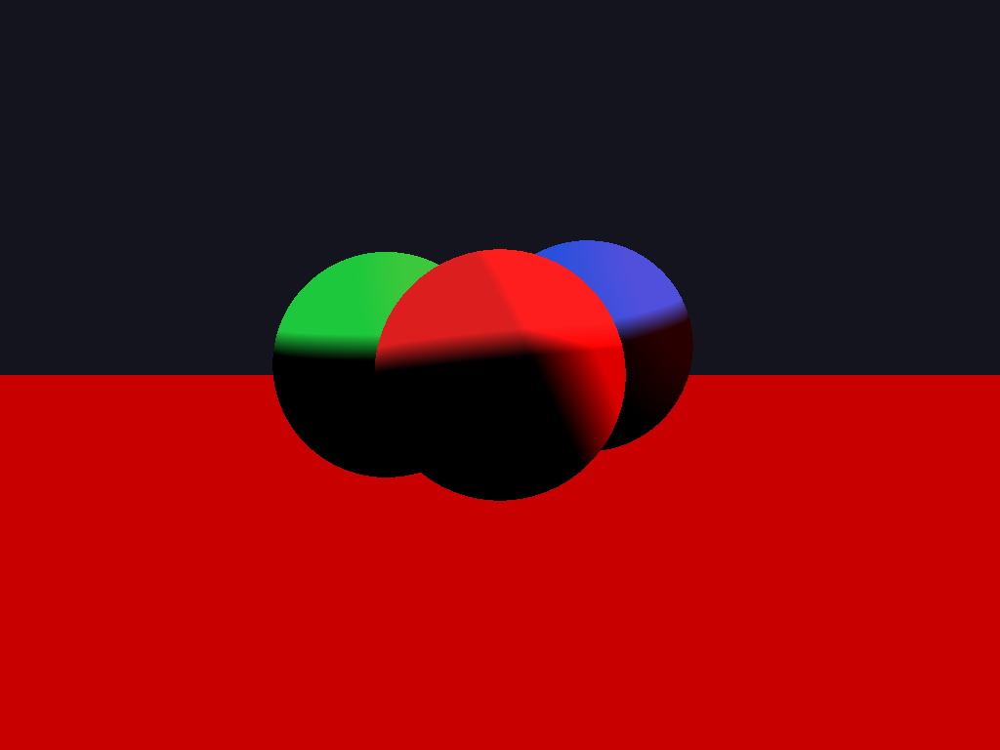
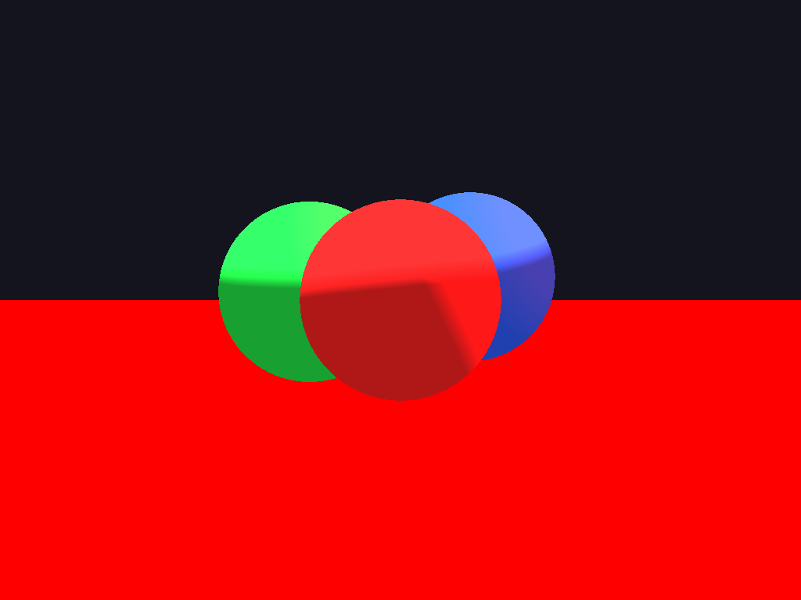
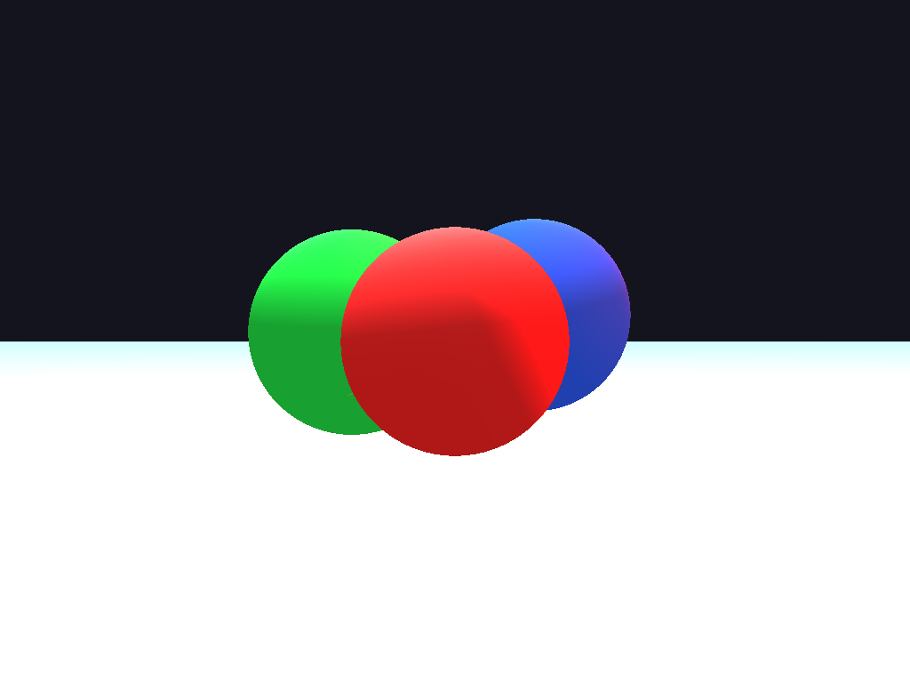
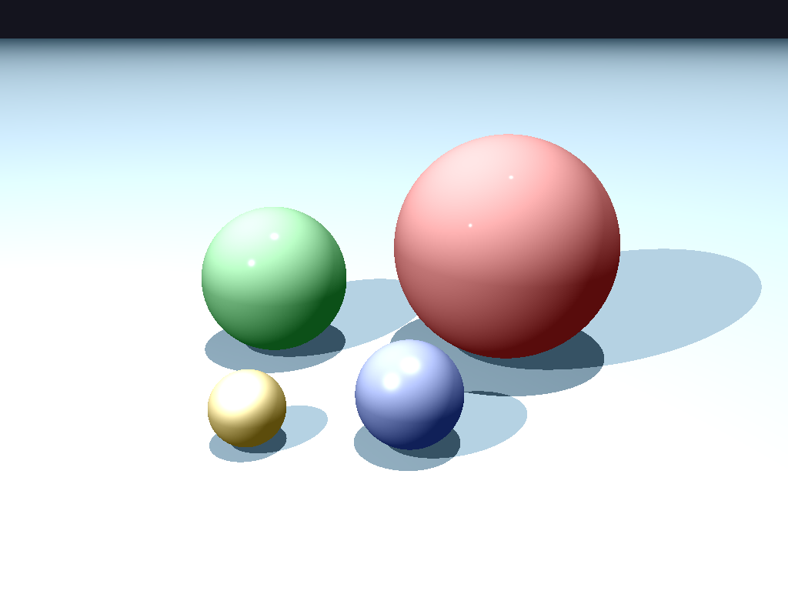

# Rust Ray Tracer

Ray tracing 3D renderer built from scratch with Rust lang. (in progress)

[Rebuild pictures](docs/render-progression.py).

## 1. One ball.



## 2. More balls.



## 3. Add plane. Balls get floor.



## 4. Add lights.



## 5. Add ambient shading.



## 6. Make shiny. Blinn–Phong shading.



## 7. Add shadows.



## Run it.

Need Rust. Run:

```sh
cargo run --release
```

Four views. Four PNGs: `output_front.png`, `output_right.png`, `output_back.png`, `output_left.png`.

## To be continued... 😆
